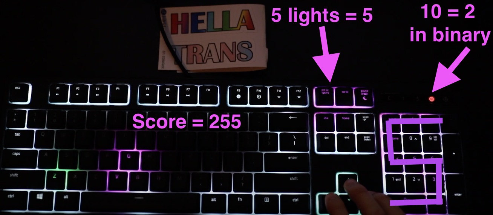

# Keyboard Lighting 

A collection of simple scripts controlling keyboard lighting using [OpenRazer](https://openrazer.github.io/). Due to the lack of other equipments, I have not tested the scripts on other keyboards, but in theory they should work.

Tested on ArchLinux 2020.09.01 with Python 3.8, Razer Ornata Chroma. 

## Dependencies

- OpenRazer
- NumPy

## Running the program

First, make sure you have OpenRazer installed. Then, you can set the keyboard into the particular lighting I picked by running 
```
python3 normal.py
```

Or you can play the minigame with 
```
python3 game.py
```

Or you can reproduce the animation went into [this video](https://www.youtube.com/watch?v=mTbFY7eamDs) by running 
```
python3 animation.py
```

Note that you have to make sure the OpenRazer daemon is NOT running for the scripts to work (so they don't fight over the keyboard's control). 

## A note on the game

It might not be very obvious at first glance but the game actually comes with a score tracker that can display up to 399 points.  




